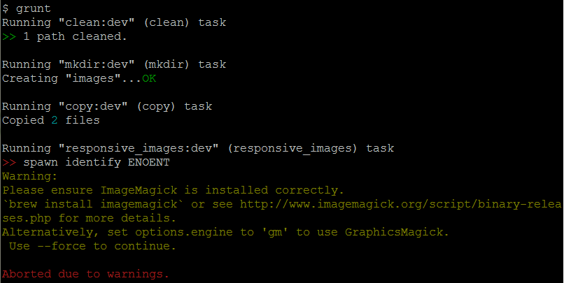

#Udacity Responsive Images course#

This is a repository for files used in the forthcoming Udacity Responsive Images course.

##Project##

Code for solutions to each stage of the course project is available from the repo's [project directory](https://github.com/udacity/responsive-images/tree/master/project).

View each of the project steps live at [udacity.github.io/responsive-images/project](http://udacity.github.io/responsive-images/project).

##Examples##

Code for these examples is available from the repo's [examples directory](https://github.com/udacity/responsive-images/tree/master/examples).

View examples live at [udacity.github.io/responsive-images](http://udacity.github.io/responsive-images/). (This is the [GitHub Pages](https://pages.github.com) site that corresponds to the gh-pages branch of the repo.)

##Reflections##
###Part 1###

*Using Windows for this project.*

The only difficult part about this was resizing and compressing the images. I was having trouble running the grunt commands because I kept getting this error:

This was happening because I was running the command on git bash. The solution was to run this on the command prompt instead.
